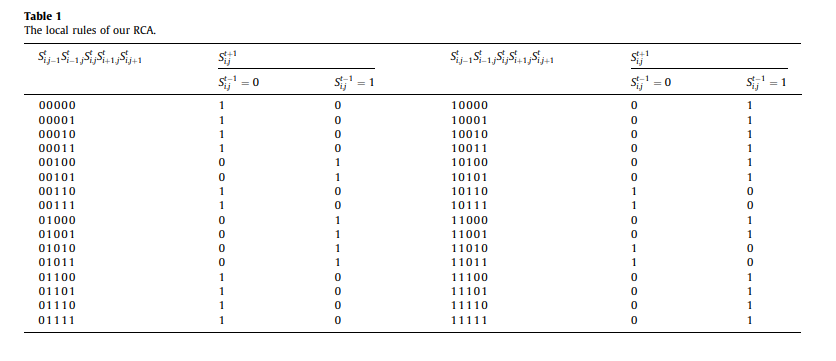

# Autómatas Celulares: Aplicaciones criptográficas

En mi Trabajo de Fin de Grado, quiero implementar distintos algoritmos para encriptar tanto texto como imágenes usando autómatas celulares. También se incluye el script 'reglas.py', diseñado para representar visualmente distintas clases de autómatas celulares.

## Encriptación de texto
Usaremos la **Regla 30**, que es una regla de evolución para un autómata celular unidimensional, para cifrar palabras o texto.

La evolución de cada celda se define mediante la siguiente operación lógica:
$$c_i^{(t+1)} = c_{i-1}^{(t)} \oplus (c_i^{(t)} \lor c_{i+1}^{(t)})$$

Donde $\oplus$ representa la operación XOR y $\lor$ la operación OR.

### Metodología de Encriptación de texto
Se parte de una secuencia inicial dada. 
1. Se genera una secuencia binaria a partir de la Regla 30.
2. Se convierte el texto introducido por el usuario a binario según la norma latin-9.
3. Se aplica una operación **XOR** entre el mensaje dado pasado a binario y la secuencia generada por la Regla 30, y se vuelve a pasar a mensaje legible, usando el sistema latin-9 (para evitar problemas con símbolos como 'ñ' o 'à'), para obtener la nueva palabra encriptada.
4. Para revertir el proceso, dado el criptograma y la misma clave, se vuelve a aplicar la operación **XOR**, que es su propia inversa y permite recuperar el mensaje original.

Este algoritmo de cifrado de mensajes usando la regla 30 está inspirado en el siguiente artículo:
* **Título del artículo:** "Descripción y Aplicaciones de los Autómatas Celulares"
* **Autor:** David Alejandro Reyes Gómez
* **Enlace:** [Haz clic aquí para leer el artículo](https://www.comunidad.escom.ipn.mx/genaro/Papers/Veranos_McIntosh_files/Articulo%20Verano%20De%20Investigacion%202011.pdf)

## Encriptación de imágenes
### Metodología de Encriptación de imágenes
Se parte de una imagen inicial.
1. Se convierte en una matriz de píxeles.
2. La encriptación consta de 2 fases: Confusión y Difusión.
3. En la fase de Confusión, a través de un mapa caótico, se permutan los elementos de la matriz.
4. En la fase de Difusión, la matriz se modifica siguiendo la tabla de reglas locales, que consideran los vecinos de cada célula y su estado anterior para poder asegurar su reversibilidad:
   #### Reglas Locales del Autómata Reversible (RCA)
   
     
   
5. Finalmente se realiza una operación auxiliar:
   $$c_i = c_{i-1} \oplus p'_i \oplus \text{mod}(\lfloor z_i \cdot 10^{13} \rfloor, 256)$$ .

**Nota sobre la implementación** Se incluyen dos archivos que cifran y descifran imágenes siguiendo este mismo proceso. El archivo 'encriptacion_imagenes.py' usa como forma de datos las matrices de **NumPy**, mientras que 'encriptacion_imagenes_listas.py' utiliza listas de listas de Python tradicionales.

Este proyecto busca encriptar imágenes , usando algoritmos basados en el siguiente artículo:
* **Título del artículo:** "A novel image encryption algorithm using chaos and reversible cellular automata"
* **Autores:** Xingyuan Wang, Dapeng Luan
* **Enlace:** [Haz clic aquí para leer el artículo](https://www.sciencedirect.com/science/article/abs/pii/S1007570413001524?fr=RR-1&ref=cra_js_challenge)

## Visualización de autómatas celulares
Usaremos el script reglas.py para simular la evolución temporal y visualizar gráficamente cualquiera de las 256 reglas elementales de autómatas celulares unidimensionales (como la Regla 30 o la Regla 110).

La evolución de cada celda depende de su propio estado y del de sus dos vecinas más próximas, determinado el siguiente estado mediante una función local $\delta$:
$$c_i^{(t+1)} = \delta(c_{i-1}^{(t)},c_i^{(t)},c_{i+1}^{(t)})$$

### Metodología de visualización
Se parte de unos parámetros configurables definidos en el código: el número de regla, los pasos temporales, el número de celdas y la configuración inicial.
1. Se genera una lista con la representación binaria de 8 bits correspondientes a la regla seleccionada.
2. Se inicializa el autómata con una configuración inicial $v_0$. Por defecto, un único valor $1$ en el centro y el resto $0$.
3. En cada iteración se recorren todas las celdas, aplicando unas condiciones de contorno periódicas (ambos extremos están conectados).
4. Para cada celda se calcula su índice correspondiente a:
$$I=(c_{i-1}^{(t)} \ll 2) | (c_i^{(t)} \ll 1) | c_{i+1}^{(t)} $$
5. Dado que el nombre de las reglas viene determinado por el valor decimal obtenido al codificar en binario la secuencia ordenada de los estados resultantes de su función de transición local, evaluando los vecindarios desde $111$ hasta $000$, almacenando el bit más significativo en la posición $0$ de la lista, el nuevo estado se define accediendo a la posición $7-I$ de la regla. 

## Requisitos previos
Para ejecutar los scripts, es necesario tener instaladas las siguientes librerías de Python:
- 'numpy' (para las matrices y vectores).
- 'Pillow' (para la lectura y manipulación de imágenes).
- 'matplotlib' (para la representación gráfica de las reglas).

## Cómo usar el proyecto
1. Se debe tener instalado Python.
2. Abrir el archivo principal en el entorno que se prefiera (p.e. Spyder).
3. En el caso de encriptar textos:
     Ejecutar el script encriptacion_texto.py e introducir la palabra/texto que se desee encriptar, seguido del estado inicial del que partirá el Autómata para la regla 30. Por ejemplo, sea r0=[0,0,0,0,0,0,0,0,0,0,0,0,1,0,0,0,0,0,0,0,0,0,0,0,0], encripta('hola',r0) o volviendo a ejecutar la función encripta son el criptograma obtenido, encripta('ÑäKÜ',r0), si se quiere desencriptar. El estado inicial tiene que ser el mismo en ambos casos.

4. En el caso de las imágenes:
     Se debe ejecutar el script encriptacion_imagenes.py o encriptacion_imagenes_listas.py (ambos realizan lo mismo pero de diferentes formas) e introducir el nombre de la imagen que se desee encriptar. Esta tiene que estar en la misma ubicación que el programa. Ej: encripta_img $("p1.png", x_0, y_0, z_0, u, k_1, k_2, k_3,t,C_ini)$, para unos parámetros $x_0,y_0,z_0,u,k_1,k_2,k_3,t,C_ini$ seleccionados para que cumplan unos requisitos dados. En el archivo del programa ya se han inicializado unos valores, por lo que para ejecutarlo bastaría con usar su nombre. Para poder desencriptar, dentro del mismo archivo, hacer uso de la función inversa con la imagen generada: desEncripta_img$("resultado.png",x_0,y_0,z_0,u,k_1,k_2,k_3,t,C_ini)$, usando los mismos parámetros que al encriptar.

6. En el caso de reglas.py:
   Ejecutar el script y cambiar los valores de regla, pasos, celdas y $v_0$ en el código. Por defecto la configuración inicial es un vector de longitud celdas de ceros con un 1 en el centro. Si se desea otro valor inicial, modificar $v_0$. Ej: reglas(regla,pasos,celdas,$v_0$). Se abrirá una ventana de representación gráfica del autómata deseado.

### Tecnologías utilizadas
- **Lenguaje:** Python
- **Librerías:** NumPy, Pillow,Matplotlib 
- **Entorno:** Spyder
- **Control de versiones:** Git y GitHub
